# 3명의 개발자들의 업무영역 확장에 대한 경험과 고민
- 17년동안 소프트웨어 개발자로 자녀에게 자랑하려고 시작한 멘토링,  
  개발자를 가르치는 개발자의 경험과 고민, 
  그리고 지금 내가 하고 있는 일... 임성현

    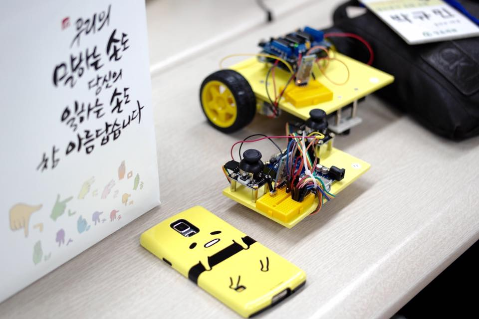

## 1. 나

 [개발자]
  - IMF 세대. 개발자의 시작(~17년차)
  - SM,SI,솔루션,품질관리
  - 개발자를 가르치는 개발자

 [남이모르는 나]
  - 취미: 혼자 미술관 가기
  - 대학원 진학, 기술사 학습
  - 석사이후, 기술사 이후

    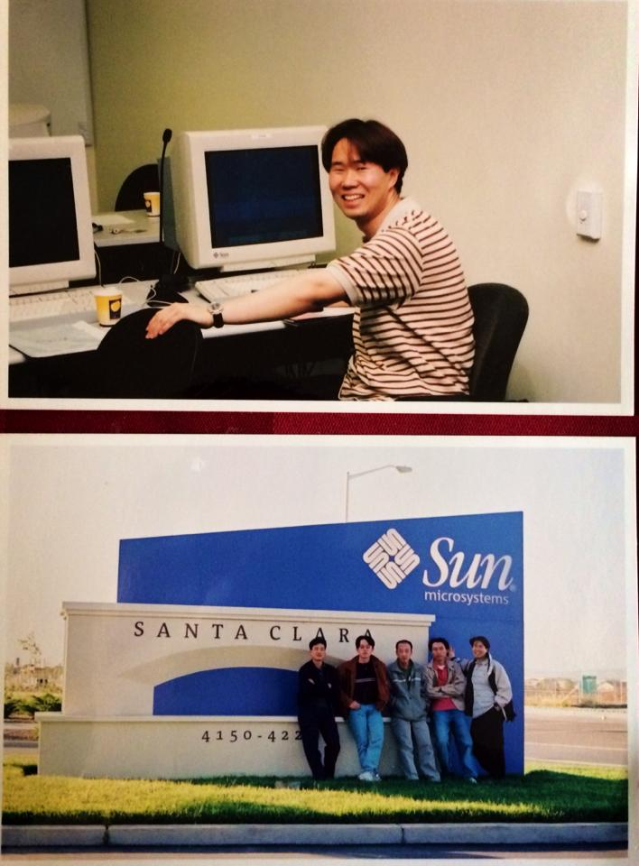

## 2. 대학생을 가르치는 아빠
  - 자녀에게 자랑하려 시작한 멘토링
  - 멘티와 함께 누군가에게 실질적 도움
    - 분교/낙도 어린이에게 아두이노 가르치기 - 정보 소외

    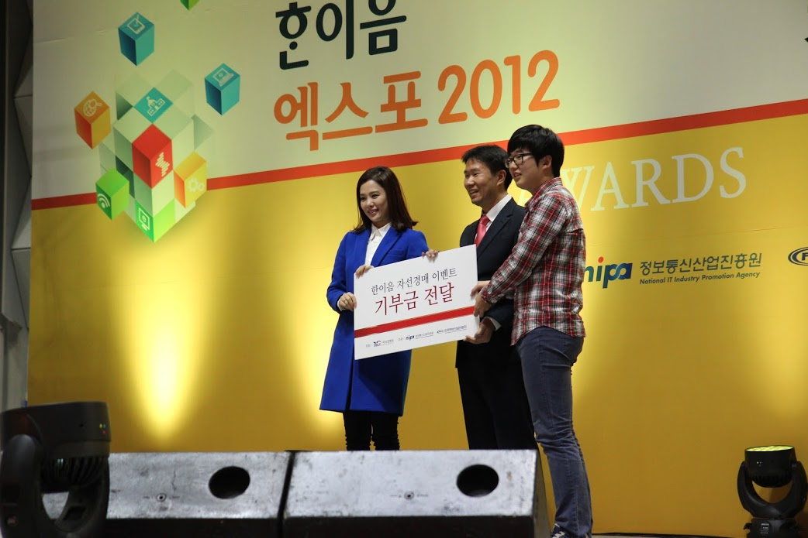

    - 시각장애 어린이를 위한 구연동화 앱 - 100명이 함께 한 프로젝트
    - 시각장애인을 위한 지폐인식 앱 구현 - 시각장애인 사용자의 실제적 요구사항
  - 좀 더 진지하게 접근하기 시작

## 3. 청각장애 복지관 - 청음회관
  - 2014년 겨울. 강의 요청
    - 속기사, 수화통역으로 부트스트랩 강의
    - 또 한명의 기술사, 안드로이드 강의
    - 요청사항: 취업
  - 2015년 .실질적 도움 - 테스팅
    - 10여명의 청각장애 IT인 모임
    - 테스트 대상 프로그램을 파악하고, 테스트 계획하고, 리포팅하고.
    - 2015년 프로슈머 준비반 진행

    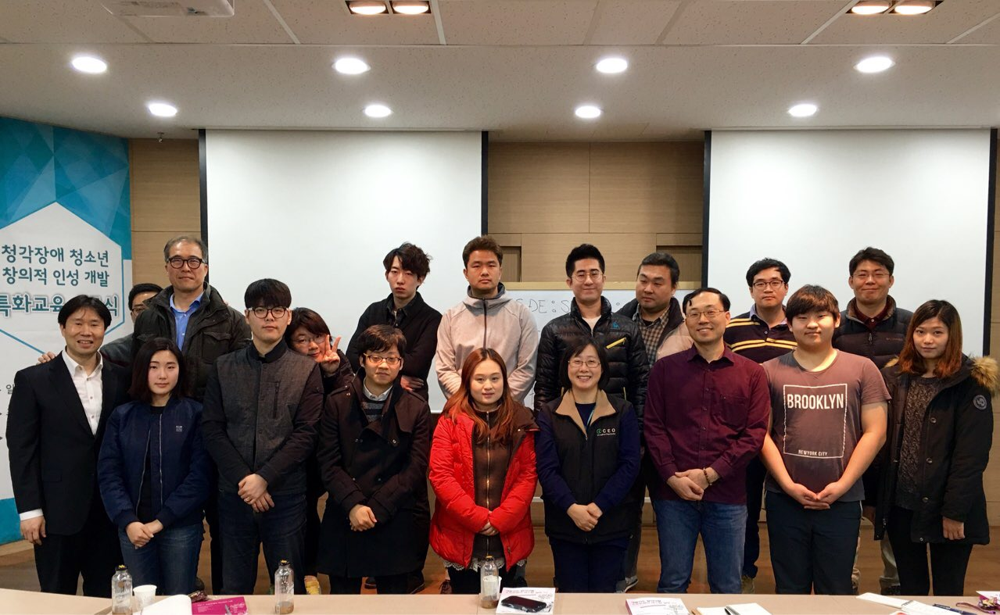

    - 589명 중 3명에게 주는 우수상 수상

    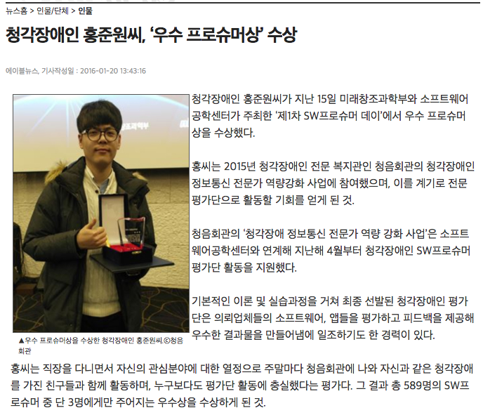

     http://www.ablenews.co.kr/News/NewsPrint/Print.aspx?NewsCode=003320160120134316258120

## 4. 청각장애 청소년
  - 보청기의 발전과 기존 교육의 어려움
  - 아두이노, 수화로 설명하는 변수명, 코드
  - 큰도움. 튜터 선생님. 사회성 교육
    - 멘티 참여 -> 덕성여대 학생들 지원
  - 학기중 행사
    - 파워포인트, 동영상 편집

    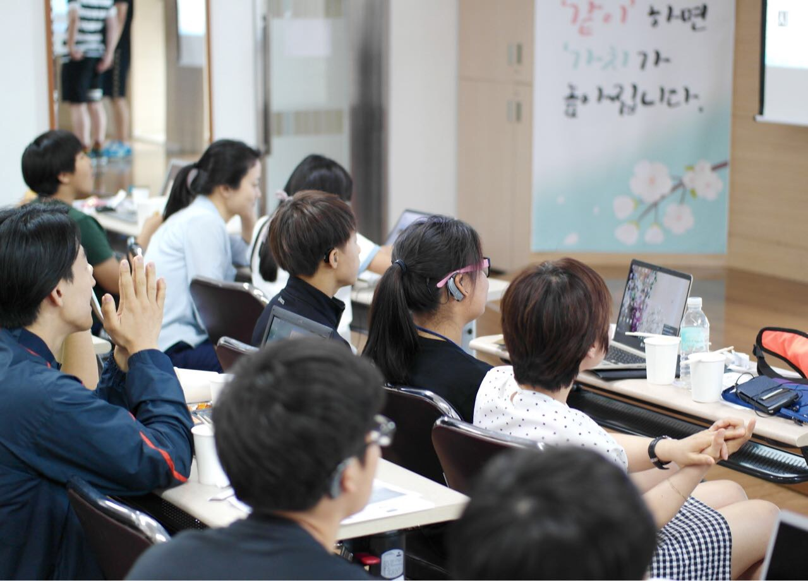

  - 방학 행사
    - 아두이노로 로봇 만들기

## 5. 동참자 17인 + 대학생 20명, 늘푸른소리 출범
  -  늘푸른소리 : https://www.facebook.com/Evergreen.Sounds.kr/

  - 청음 청소년 대상 로봇 축구대회 진행

    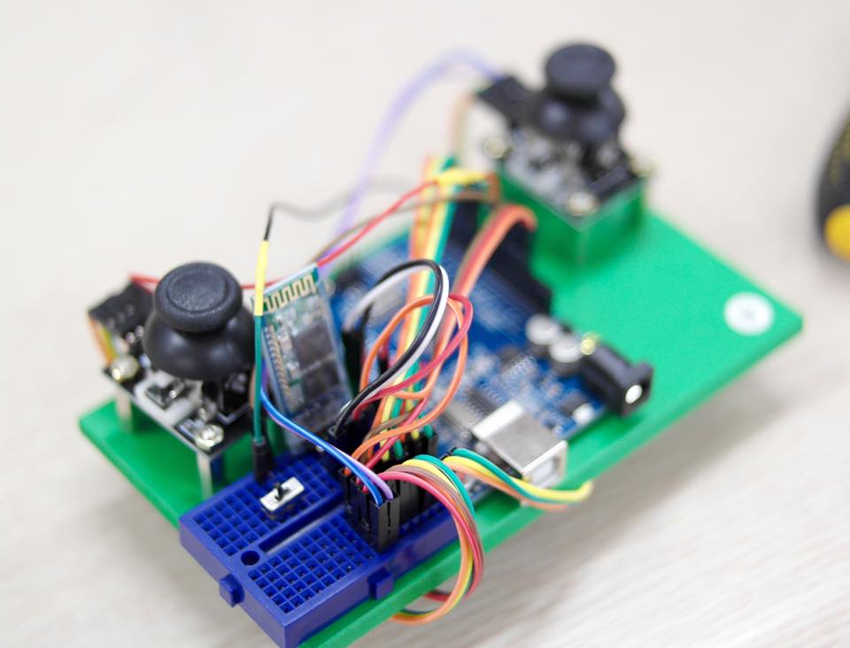

    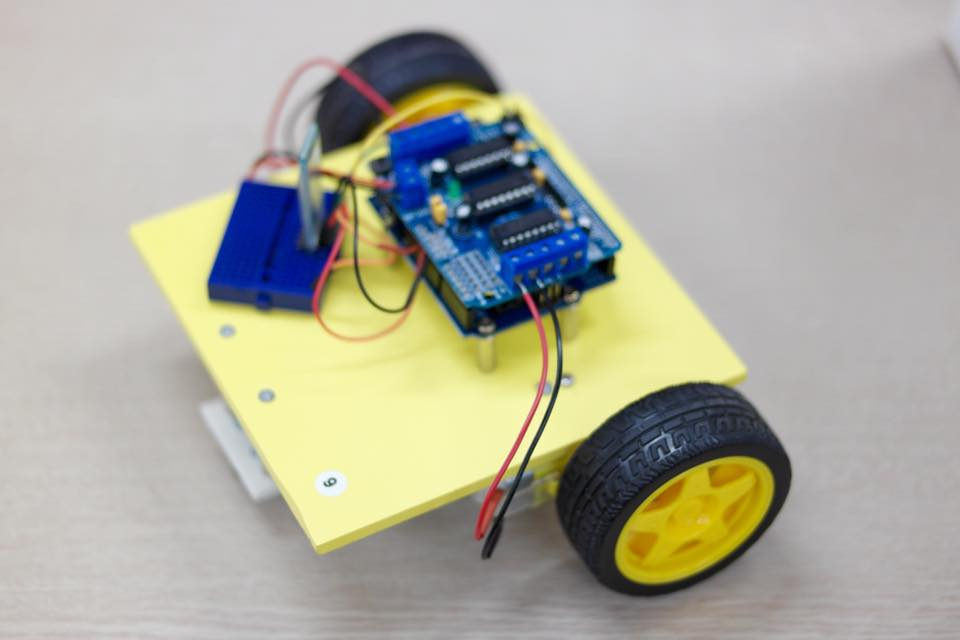

    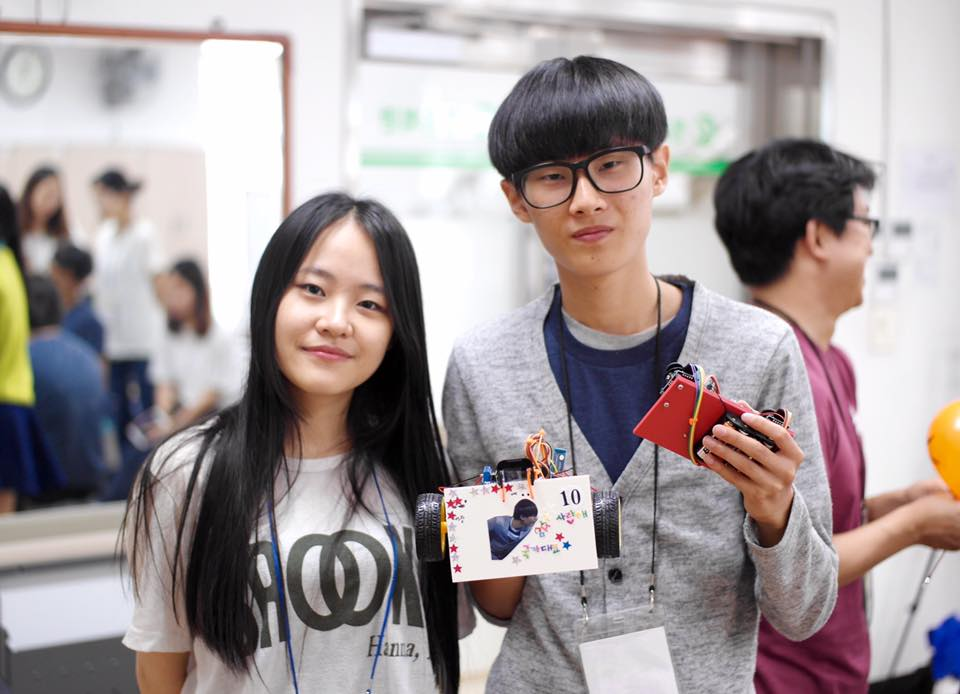

    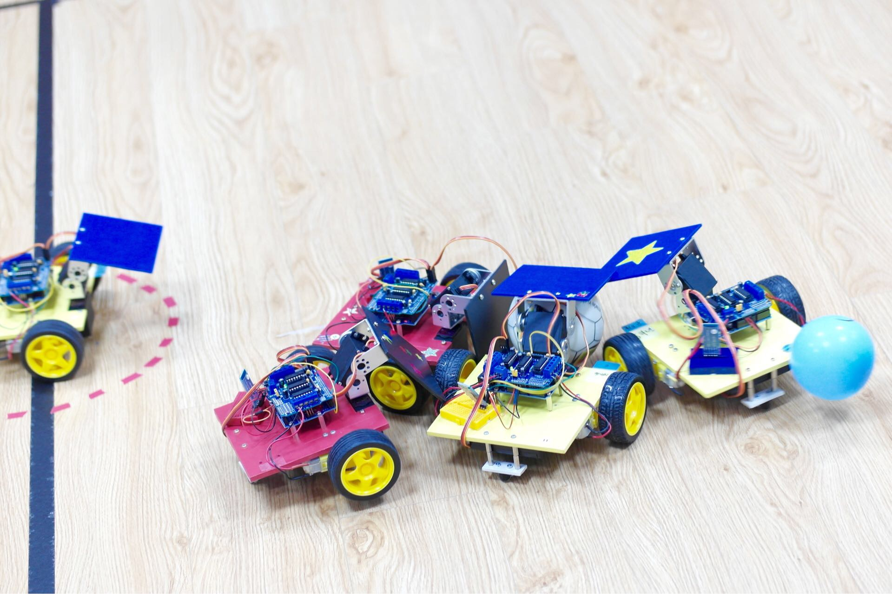

    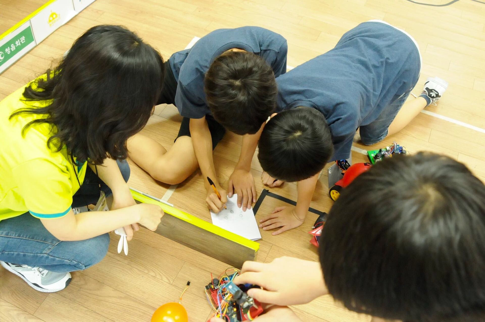

  - D 지역아동센터 컴퓨터활용능력 시험준비
  - 청각장애 대상 생활코딩 자막 진행(속기사 10명, 기술사 10명)

    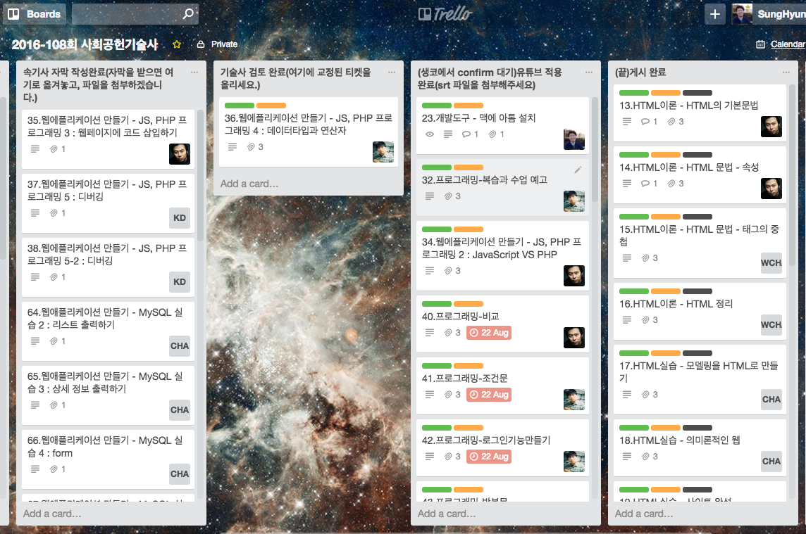
  - 메이커페어, 구글캠퍼스 진행

## 6. 일. 회사. 가족. 고민. 봉사. 공유하고 공존하는 삶.
  - 소프트웨어 교육
  - 융합 소프트웨어
  - 개발자의 필수 역량 : 사회성
  - 가족

    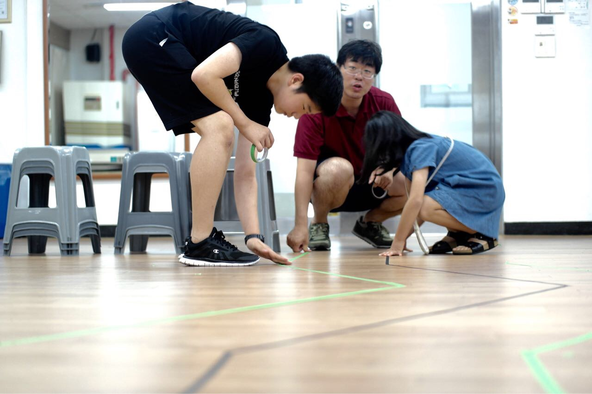

  - 행사사진

    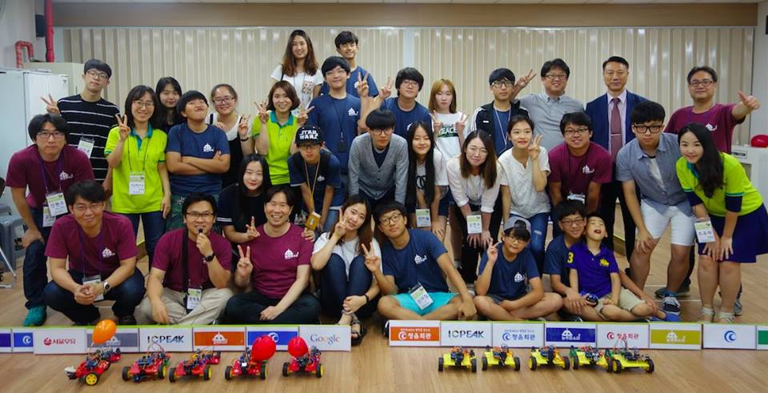
    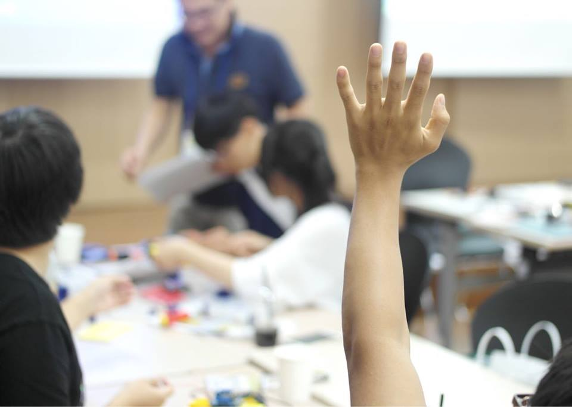
